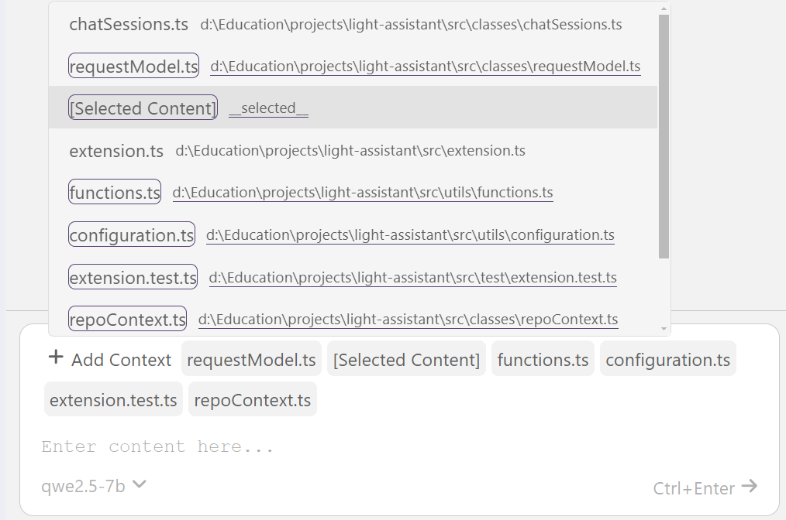
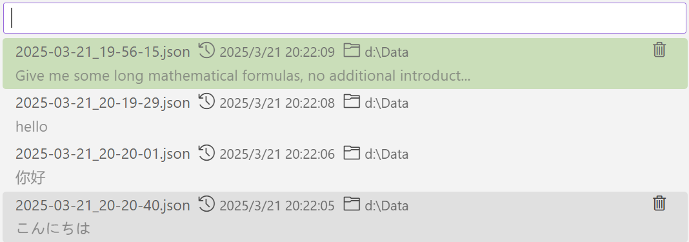

    
    <h1 align="center">light-assistant</h1>
    
Light Assistant is an open-source lightweight intelligent assistant for VS Code. Compared to coding capabilities, Light Assistant focuses more on the large model chat function.

    

        | <b>English</b> | <a href="https://github.com/HiMeditator/light-assistant/blob/main/docs/README_zh_cn.md">简体中文</a> | <a href="https://github.com/HiMeditator/light-assistant/blob/main/docs/README_ja.md">日本語</a> |
    

## User Manual

- [User Manual](docs/user-manual.md)
- [用户手册](docs/user-manual_zh_cn.md)
- [ユーザーマニュアル](docs/user-manual_ja.md)

## Features

### Mathematical Formula Rendering

Makes up for the shortcoming of most intelligent assistants lacking mathematical formula rendering.

### Convenient Model Configuration

### Select Chat Context

### Chat Record Management

