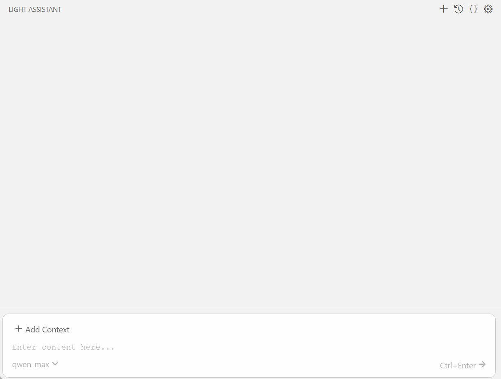
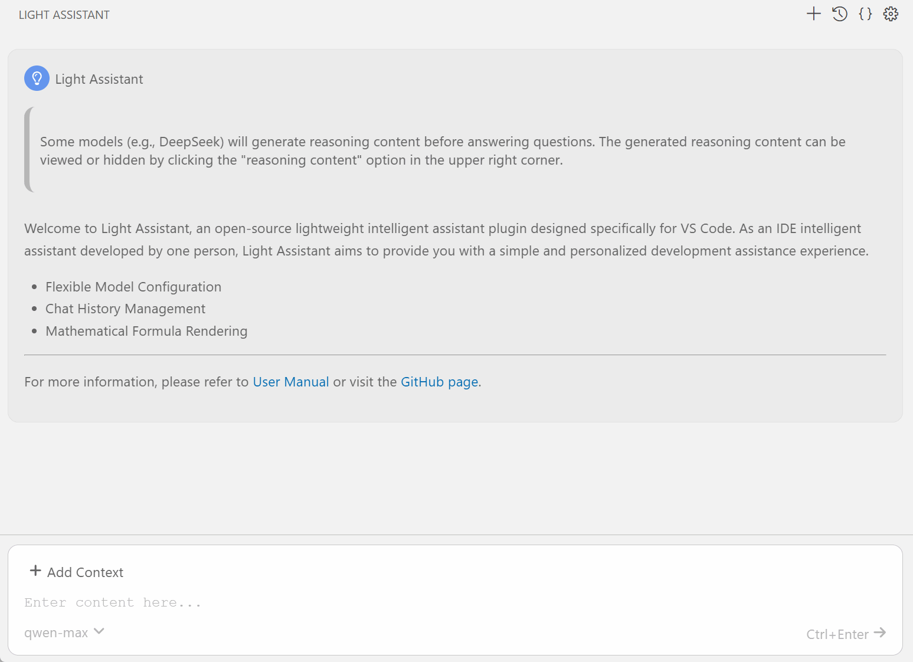

    
    <h1 align="center">light-assistant</h1>
    
Light Assistant（ライトアシスタント）は、VS Code 向けのオープンソースで軽量なインテリジェントアシスタントです。コード能力よりも、Light Assistant は IDE 内で大言語モデルとチャットする体験に重点を置いています。

    

        | <a href="https://github.com/HiMeditator/light-assistant/blob/main/README.md">English</a> | <a href="https://github.com/HiMeditator/light-assistant/blob/main/docs/README_zh_cn.md">简体中文</a> | <b>日本語</b> |
    

## ユーザーマニュアル

- [User Manual](user-manual.md)
- [用户手册](user-manual_zh_cn.md)
- [ユーザーマニュアル](user-manual_ja.md)

## 特徴

### 数式レンダリング

ほとんどのインテリジェントアシスタントが数式レンダリングに対応していないという欠点を補っています。

### 自由なモデル設定

### チャットコンテキストの選択

### チャット記録の管理

## クレジット

- [アイコン](../assets/icon/credits.md)
- [JSライブラリ](../assets/js/libs/credits.md)
