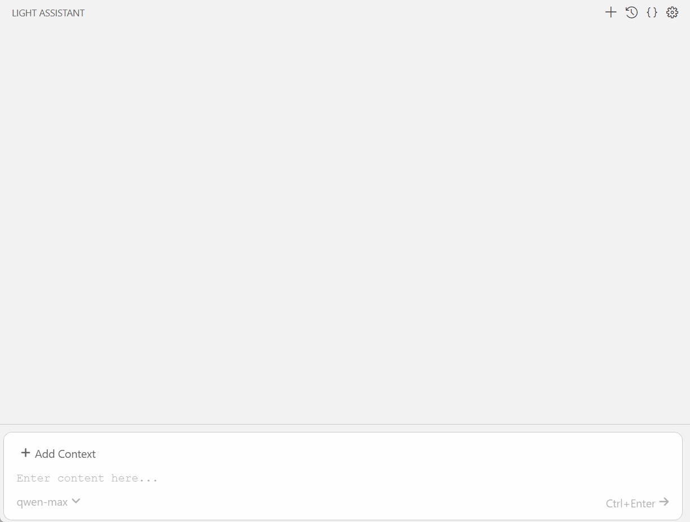
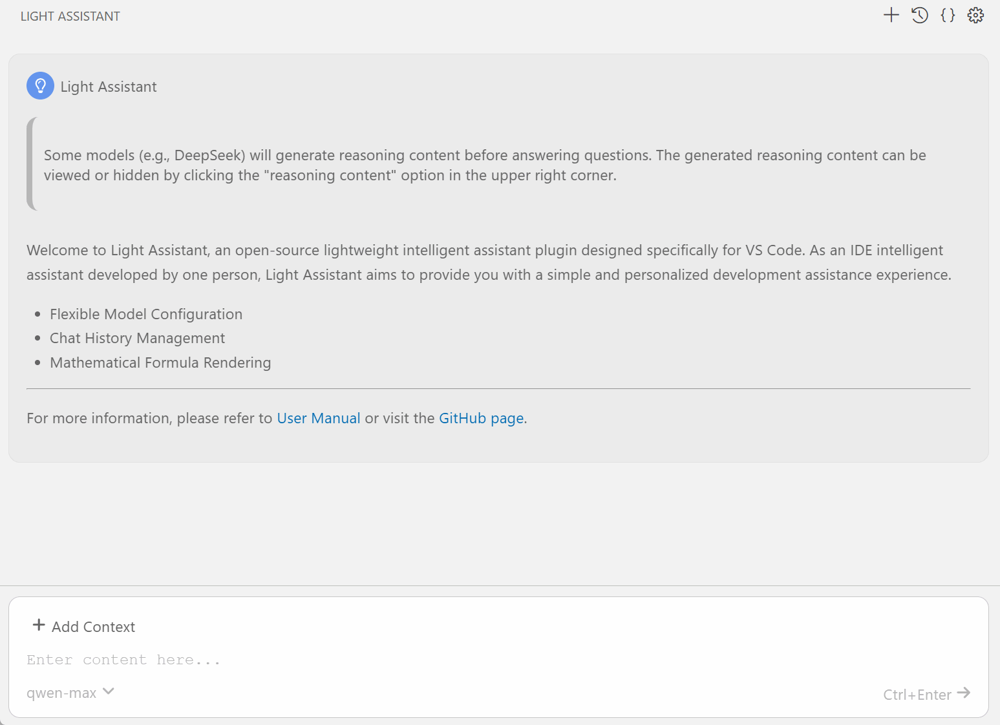
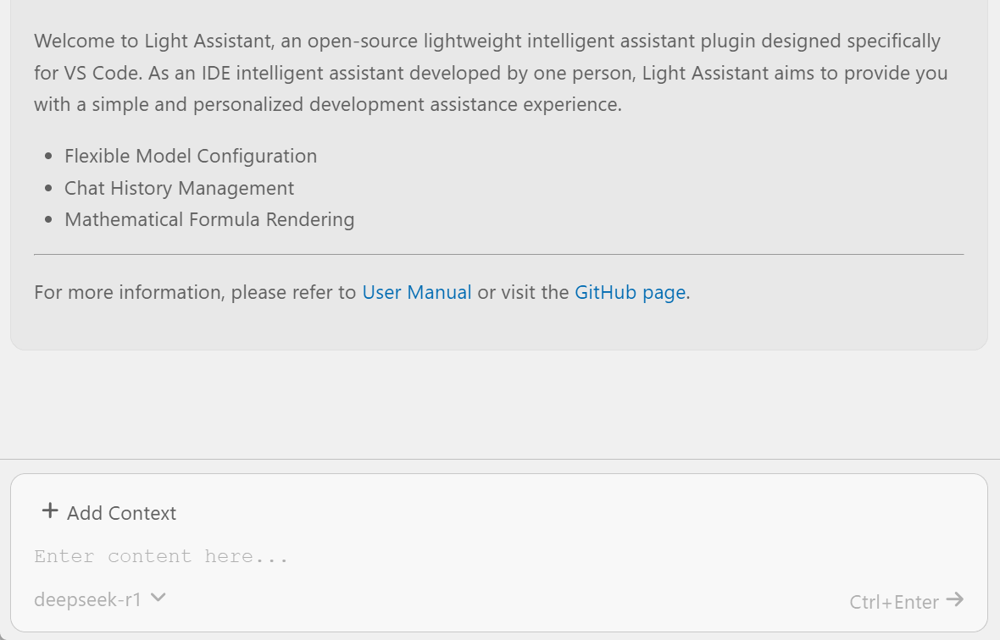
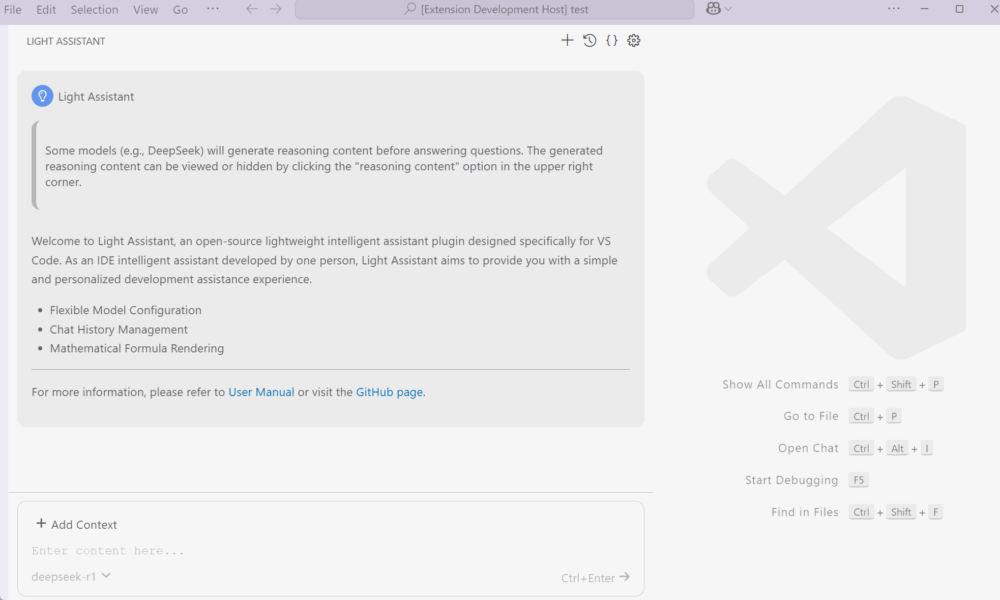

    
    <h1 align="center">light-assistant</h1>
    
Light Assistant（轻亮助手）是一个开源的面向 VS Code 的轻量级智能助手。比起代码能力，Light Assistant 更注重 IDE 内与大模型聊天的体验。

    

        | <a href="https://github.com/HiMeditator/light-assistant/blob/main/README.md">English</a> | <b>简体中文</b> | <a href="https://github.com/HiMeditator/light-assistant/blob/main/docs/README_ja.md">日本語</a> |
    

## 用户手册

- [用户手册](user-manual_zh_cn.md)
- [User Manual](user-manual.md)
- [ユーザーマニュアル](user-manual_ja.md)

## 特性

### 数学公式渲染

弥补了大多数智能助手没有数学公式渲染的缺点。

### 方便的模型配置

### 选择聊天上下文

### 聊天记录管理

