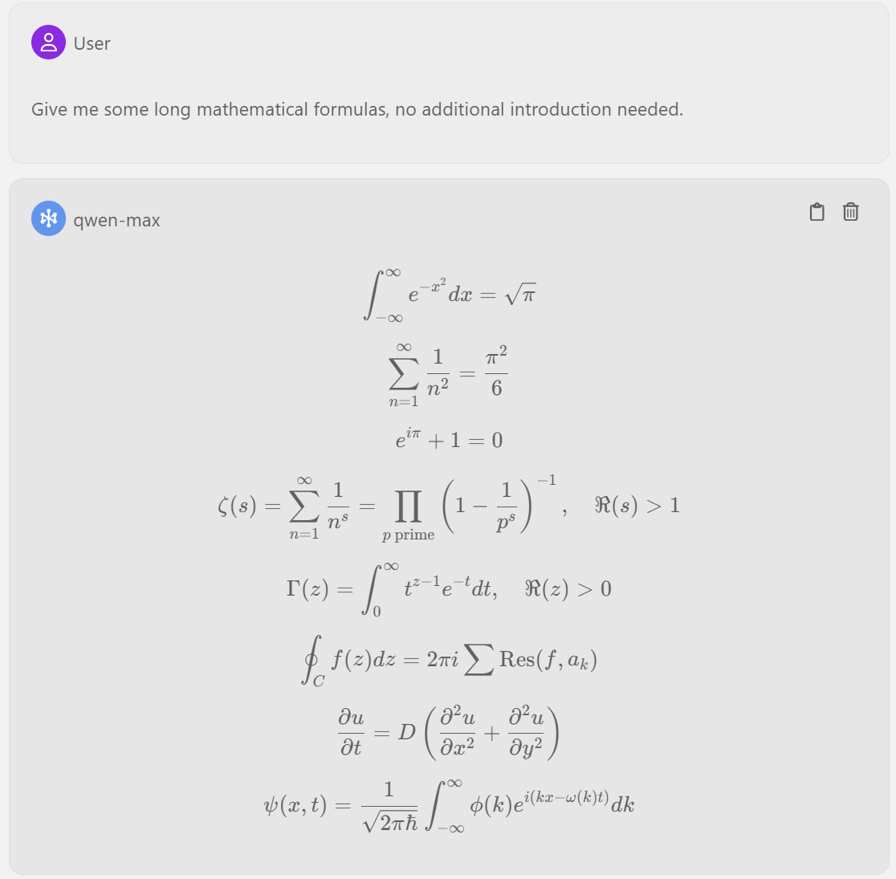

    
    <h1 align="center">light-assistant</h1>
    
Light Assistant 是一个轻量级的 VS Code 代码助手插件.

    

        | <a href="https://github.com/HiMeditator/light-assistant/blob/main/README.md">English</a> | <b>简体中文</b> |
    

    
目前，本插件正在初步开发中，仅聊天功能开发完成。

## 特性

### 自由配置模型

### IDE 内聊天

