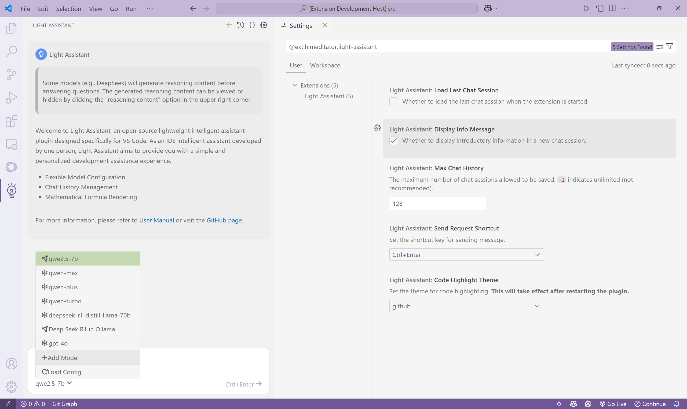

# Light Assistant User Manual

Plugin Version v0.0.3

[简体中文版](user-manual_zh_cn.md)

## Configuring Models



### Configuring Models via Configuration File

Click the `Open Config` option in the top-right corner of the plugin interface to navigate to the plugin configuration file, where you can quickly configure chat models.

The configuration format is as follows:

```json
{
  "models": [
    {
      "type": "ollama/openai",
      "model": "model name",
      "title": "display name",
      "base_url": "https://model_base_url",
      "api_key": "sk-********************************"
    }
  ]
}
```

- `type`: Required. Model type, options are: `ollama` or `openai`. `ollama` uses locally configured models with [Ollama](https://github.com/ollama/ollama), while the `openai` uses the OpenAI library in Node.js to call cloud-based models.
- `model`: Required. Model name, for example: `llama3.3-70b-instruct`.
- `title`: Optional. Display name for the model. If not set, it defaults to the value of `model`.
- `base_url`: Required if `type` is `openai`. The base URL for API requests, depending on your model service provider.
- `api_key`: Required if `type` is `openai`. The API key is obtained from your model service provider.

Here is a specific example:

```json
{
  "models": [
    {
      "type": "ollama",
      "model": "qwen2.5",
      "title": "qwen2.5-7b"
    },
    {
      "type": "ollama",
      "model": "deepseek-r1"
    },
    {
      "type": "openai",
      "model": "qwen-max",
      "base_url": "https://dashscope.aliyuncs.com/compatible-mode/v1",
      "api_key": "sk-********************************"
    },
    {
      "type": "openai",
      "model": "deepseek-r1-distill-llama-70b",
      "title": "ds-r1-dstl-llama",
      "base_url": "https://dashscope.aliyuncs.com/compatible-mode/v1",
      "api_key": "sk-********************************"
    }
  ]
}
```

After writing the configuration file, hover over the `Select Model` option and click the `Load Config` option that appears to load the configured models.

### Configuring Models via Plugin Interface

In the lower-left corner of the plugin, hover over the `Select Model` option and click the `Add Model` option that appears. Fill in the relevant information and submit to add a model.

## Chatting

After configuring the models, you can start chatting. Enter content in the input box and press `Ctrl+Enter` or click the send button to send the chat content.

You can click the `View Chat Logs` option in the top-right corner of the plugin interface to view chat log files.

You can click the `New Chat Session` option in the top-right corner of the plugin interface to create a new session.

## Other Features

You can click the `Open Settings` option in the top-right corner of the plugin interface to modify settings.