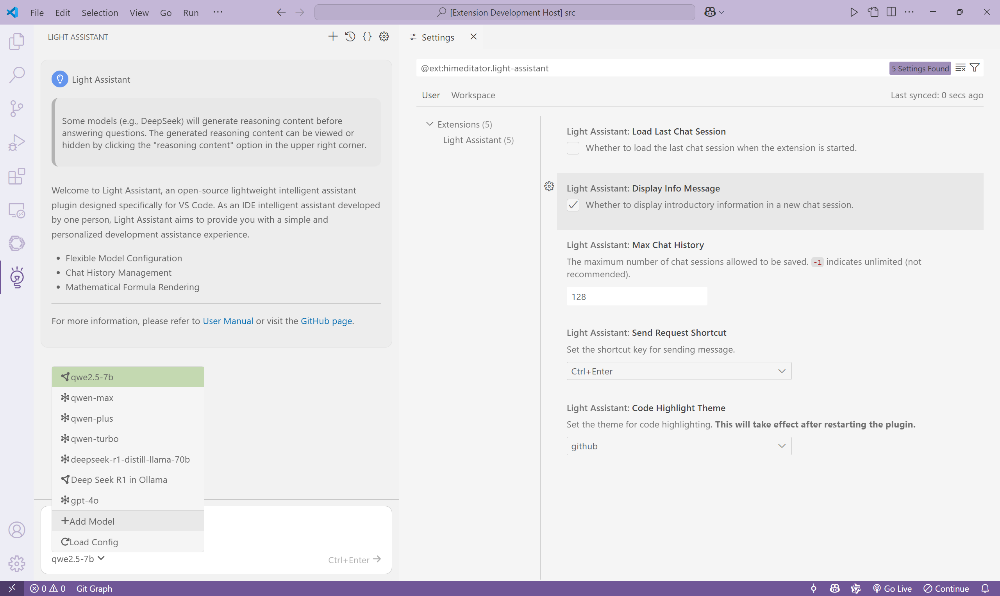

# Light Assistant 用户手册

适用于插件版本 v0.0.3

[English Version](user-manual.md)
[日本語版](user-manual_ja.md)

## 配置模型



### 通过配置文件配置模型

点击插件界面右上角 `Open Config` 选项，跳转到插件配置文件，可以在这里快速配置聊天模型。

配置格式如下：

```json
{
  "models": [
    {
      "type": "ollama/openai",
      "model": "model name",
      "title": "display name",
      "base_url": "https://model_base_url",
      "api_key": "sk-********************************"
    }
  ]
}
```

- `type`：必须。模型类型，可选值：`ollama` 或 `openai`。前者使用本地 [Ollama](https://github.com/ollama/ollama) 配置的模型，后者使用 node.js 的 OpenAI 库调用云端模型。
- `model`：必须。模型名称，例如：`llama3.3-70b-instruct`。
- `title`：可选。模型显示名称，如果不设置，默认为 `model` 的值。
- `base_url`：若 `type` 为 `openai` 则必须。API 请求的基础 URL，取决于您的模型服务商。
- `api_key`：若 `type` 为 `openai` 则必须。API 密钥，从您的模型服务商获取。

以下是一些提供商的 `base_url`：
- OpenAI: https://api.openai.com/v1
- DeepSeek：https://api.deepseek.com
- 阿里云：https://dashscope.aliyuncs.com/compatible-mode/v1

以下是一个具体示例：

```json
{
  "models": [
    {
      "type": "ollama",
      "model": "qwen2.5",
      "title": "qwen2.5-7b"
    },
    {
      "type": "ollama",
      "model": "deepseek-r1"
    },
    {
      "type": "openai",
      "model": "qwen-max",
      "base_url": "https://dashscope.aliyuncs.com/compatible-mode/v1",
      "api_key": "sk-********************************"
    },
    {
      "model": "gpt-4o",
      "type": "openai",
      "base_url": "https://api.openai.com/v1",
      "api_key": "sk-proj-<omitted>"
    }
  ]
}
```

编写好配置文件后，鼠标悬浮到 `Select Model` 选项上，点击出现的 `Load Config` 选项，即可载入配置的模型。

### 通过插件配置模型

在插件左下方，鼠标悬浮到 `Select Model` 选项上，点击出现的 `Add Model` 选项，即出现添加模型弹窗。填写相关信息后提交即可添加一个模型。

## 聊天

在配置好模型后即可开始聊天。在输入框输入内容后，按 `Ctrl+Enter` 或点击发送选项，即可发送聊天内容。

可点击插件界面右上角 `View Chat Logs` 选项查看聊天记录文件。

可点击插件界面右上角 `New Chat Session` 选项新建一个会话。

## 其他

可点击插件界面右上角 `Open Settings` 修改设置。